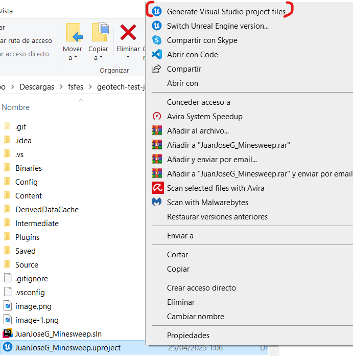
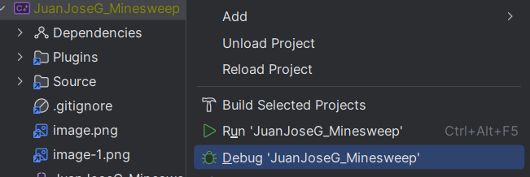
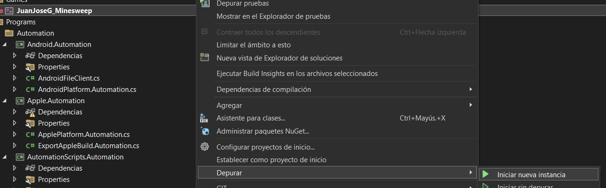

# Minesweeper tool for geotech test

## Setup
1. Right-click on the .uproject.

2. Click on "Generate Visual Studio Project files".

3. Open the solution and compile it.

_The tool can be opened from the toolbar or from the window sub-menu._

## Details
- A View-Model architecture has been applied to separate the visual aspect from the functionality and data. The View contains everything related to what the user will see and its interactions, and the Model will be in charge of processing data that will be requested by the View.

- Mines are generated when clicked to prevent loss on the first attempt

- Added a two-way scroll box

- A series of tests can be run on the Session Frontend

- References to the buttons have been stored to avoid constant casting.

- A structure called Tile2D has been created instead of using FIntegerVec2 for readability consistency since Vec2 is expressed in X and Y, and this can lead to confusion.

- A new FTileStatus structure has been created instead of using an enumerator for two reasons: more readability in the code (before the change there were lines that read `board[row][col] >= Revealed`) and for scalability (if a new tile type is introduced, all the enums would have to be reassigned).

- If you have any doubts about why I have done or designed certain things this way,  ask me : gjuanjo1999@gmail.com